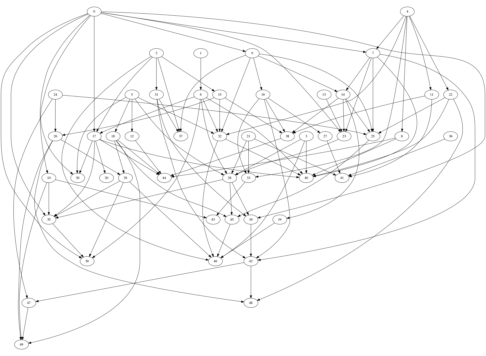

# graph_generators
This is a C++ realization of two graph generator models: Erdős–Rényi model and Model of Copying

MD files contain summaries about two models, Reny.cpp and copy.cpp - the realization.
 

